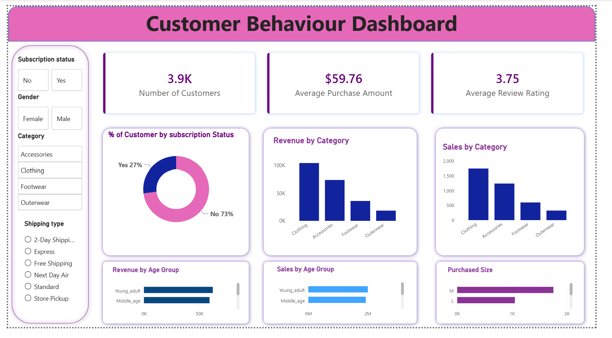

# Customer Shopping Behavior Analytics

An end-to-end **Data Analytics project** that analyzes customer shopping behavior using **Python, PostgreSQL, SQL, and Power BI**.

The project covers the complete analytics workflow — from loading and cleaning raw data to performing Exploratory Data Analysis (EDA), analyzing data with SQL, and building an interactive Power BI dashboard for business insights.

---

## 📌 Overview

The goal of this project is to understand **customer purchasing patterns, product performance, revenue trends, customer segments, discounts, subscriptions, and shopping behavior**.

The analysis follows a practical data analytics pipeline:

**Dataset → Python → Data Cleaning & EDA → PostgreSQL → SQL Analysis → Power BI → Business Insights**

---

## 📊 Dataset

The project uses a **Customer Shopping Behavior** dataset containing customer-level purchase information.

Key attributes include:

* Customer ID
* Age
* Gender
* Item Purchased
* Category
* Purchase Amount
* Review Rating
* Shipping Type
* Discount Applied
* Subscription Status
* Previous Purchases
* Payment Method
* Location
* Season
* Size
* Color
* Frequency of Purchases

The dataset is stored in:

```text
customer_shopping_behavior.csv
```

---

## 🛠️ Tools & Technologies

| Tool                 | Purpose                                 |
| -------------------- | --------------------------------------- |
| **Python**           | Data loading, cleaning and EDA          |
| **Pandas**           | Data manipulation and preprocessing     |
| **NumPy**            | Numerical operations                    |
| **Matplotlib**       | Data visualization                      |
| **PostgreSQL**       | Database storage and analysis           |
| **SQL**              | Business queries and analysis           |
| **Power BI**         | Interactive dashboard and visualization |
| **Jupyter Notebook** | Python-based analysis                   |

---

## 🔄 Project Workflow

### 1. Data Loading

The dataset was loaded into Python using Pandas.

```python
import pandas as pd

df = pd.read_csv("customer_shopping_behavior.csv")
```

Initial inspection was performed using:

* `df.info()`
* `df.describe()`
* `df.isnull().sum()`

---

### 2. Data Cleaning

Several preprocessing steps were performed to improve data quality.

#### Missing Value Handling

Missing review ratings were filled using the **median review rating within each product category**.

```python
df['Review Rating'] = df.groupby('Category')['Review Rating'].transform(
    lambda x: x.fillna(x.median())
)
```

#### Column Standardization

Column names were converted to lowercase and spaces were replaced with underscores.

```python
df.columns = df.columns.str.lower()
df.columns = df.columns.str.replace(' ', '_')
```

The purchase amount column was also renamed for easier analysis:

```text
purchase_amount_(usd) → purchase_amount
```

#### Feature Engineering

A new `age_group` column was created to categorize customers into:

* Young Adult
* Adult
* Middle Age
* Senior

A `purchase_frequency_days` column was also created by converting purchase frequency categories such as Weekly, Monthly, Quarterly, and Annually into numerical day intervals.

The redundant `promo_code_used` column was removed after checking its relationship with `discount_applied`.

---

## 🔍 Exploratory Data Analysis

EDA was performed to understand:

* Customer demographics
* Purchase amounts
* Product and category performance
* Review ratings
* Discount usage
* Subscription behavior
* Purchase frequency
* Customer purchasing patterns

The analysis helped identify patterns and prepare the dataset for database-level analysis.

---

## 🗄️ PostgreSQL & SQL Analysis

After cleaning, the processed dataset was loaded into a PostgreSQL database.

Python was used to connect to PostgreSQL through **SQLAlchemy** and **psycopg2**.

The cleaned dataset was loaded into the:

```text
customer
```

table.

### SQL Analysis Performed

Several business-focused SQL queries were developed, including:

* Revenue comparison by gender
* Customers who used discounts but spent above average
* Top 5 products by average review rating
* Average purchase amount by shipping type
* Subscriber vs. non-subscriber spending
* Products with the highest discount rates
* New, Returning, and Loyal customer segmentation
* Top 3 products within each category
* Repeat buyers and subscription behavior
* Revenue contribution by age group
* Top revenue-generating locations
* Popular payment methods
* Seasonal sales and purchase analysis
* Review ratings by product size
* Popular colors within specific categories and seasons
* Average customer age by category
* High-value customers with low review ratings
* Estimated revenue impact of discounts
* Demographic analysis of Outerwear purchases

For example, customer segmentation was created using SQL `CASE` logic based on previous purchases.

Window functions such as `ROW_NUMBER()` were also used to rank products within categories.

---

## 📈 Power BI Dashboard

The cleaned and analyzed data was used to build an interactive **Customer Behavior Dashboard** in Power BI.

### Dashboard Focus

The dashboard provides insights into:

* Overall customer purchasing behavior
* Revenue and sales performance
* Customer demographics
* Product and category performance
* Subscription behavior
* Discount usage
* Customer segments
* Seasonal trends
* Geographic performance
* Payment preferences

The dashboard allows users to interact with the data through filters and visualizations to explore different customer segments and business dimensions.

### Dashboard File

```text
Customer_Behaviour_Dashboard.pbix
```

---
## Dashboard Preview



## 💡 Key Analysis Areas

The project focuses on answering practical business questions such as:

> Which customer groups generate the most revenue?

> Do subscribed customers spend more than non-subscribers?

> Which products have the highest ratings?

> Which products receive the most discounts?

> Which locations generate the highest revenue?

> How does seasonality affect sales?

> What are the most popular products within each category?

> How can customers be segmented based on purchasing history?

These questions were answered using SQL aggregations, filtering, subqueries, CTEs, `CASE` statements, and window functions.

---

### 📁 Project Structure

```text
├── Customer_Behaviour_Dashboard.pbix
├── Customer_shopping.ipynb
├── README.md
├── customer_shopping.sql
├── customer_shopping_behavior.csv
└── dashboard_preview.png
```

## ▶️ How to Run

### Step 1 — Clone the Repository

```bash
git clone https://github.com/Taiz371/Customer_Behaviour_Analysis.git
cd Customer_Behaviour_Analysis
```

### Step 2 — Install Python Libraries

```bash
pip install pandas numpy matplotlib sqlalchemy psycopg2-binary
```

### Step 3 — Run the Jupyter Notebook

Open:

```text
Customer_shopping.ipynb
```

Run the notebook to:

1. Load the dataset
2. Inspect the data
3. Handle missing values
4. Clean and standardize column names
5. Create new features
6. Perform EDA
7. Load the processed dataset into PostgreSQL

### Step 4 — Configure PostgreSQL

Create a PostgreSQL database and update the database connection details in the notebook:

```python
username = "postgres"
password = "your_password"
host = "localhost"
port = "5432"
database = "Customer_behaviour"
```

Run the notebook cell that loads the processed DataFrame into PostgreSQL.

### Step 5 — Run SQL Queries

Open:

```text
customer_shopping.sql
```

Connect to the PostgreSQL database and execute the queries to reproduce the analysis.

The SQL file contains business-focused queries covering revenue, customer segmentation, product performance, discounts, subscriptions, seasonality, demographics, and more.

### Step 6 — Open the Power BI Dashboard

Open:

```text
Customer_Behaviour_Dashboard.pbix
```

Refresh the data source if required and explore the interactive dashboard.


## 📌 Results

The project demonstrates an end-to-end approach to transforming raw customer data into actionable business insights.

The analysis provides a structured view of:

* Customer purchasing behavior
* Revenue performance
* Product popularity
* Customer loyalty
* Subscription patterns
* Discount impact
* Seasonal purchasing trends
* Geographic revenue distribution
* Customer demographics
* Product ratings

The SQL analysis particularly demonstrates practical use of **GROUP BY, aggregate functions, subqueries, CTEs, CASE statements, filtering, ranking, and window functions**.

---

## 🚀 Skills Demonstrated

* Data Cleaning
* Exploratory Data Analysis
* Data Preprocessing
* Feature Engineering
* Python for Data Analytics
* Pandas & NumPy
* Data Visualization
* PostgreSQL
* SQL Querying
* CTEs & Subqueries
* Window Functions
* Customer Segmentation
* Business Analysis
* Power BI Dashboard Development
* Data Storytelling


## ⭐ Project Highlights

**Python → EDA → Data Cleaning → PostgreSQL → SQL Analysis → Power BI Dashboard**

This project demonstrates the ability to take a raw dataset through a complete **data analytics pipeline** and convert it into meaningful business insights.
